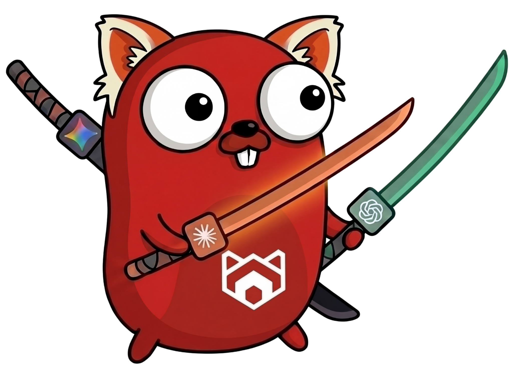

# Redpanda AI SDK for Go

[](https://pkg.go.dev/github.com/redpanda-data/ai-sdk-go)
[](LICENSE)

A Go SDK for building AI-powered applications with a unified interface across multiple LLM providers. Supports OpenAI, Anthropic, Google Gemini, AWS Bedrock, and any OpenAI-compatible API.

<p align="center">
  
</p>

## Install

```bash
go get github.com/redpanda-data/ai-sdk-go
```

## Quick Start

```go
package main

import (
	"context"
	"fmt"
	"log"
	"os"

	"github.com/redpanda-data/ai-sdk-go/llm"
	"github.com/redpanda-data/ai-sdk-go/providers/openai"
)

func main() {
	provider, err := openai.NewProvider(os.Getenv("OPENAI_API_KEY"))
	if err != nil {
		log.Fatal(err)
	}
	model, err := provider.NewModel(openai.ModelGPT5_4)
	if err != nil {
		log.Fatal(err)
	}
	resp, err := model.Generate(context.Background(), &llm.Request{
		Messages: []llm.Message{
			llm.NewMessage(llm.RoleUser, llm.NewTextPart("Explain Go interfaces in two sentences.")),
		},
	})
	if err != nil {
		log.Fatal(err)
	}
	fmt.Println(resp.TextContent())
}
```

## Providers

### Anthropic

```go
import "github.com/redpanda-data/ai-sdk-go/providers/anthropic"

provider, err := anthropic.NewProvider(os.Getenv("ANTHROPIC_API_KEY"))
model, err := provider.NewModel(anthropic.ModelClaudeOpus46)
```

### Google Gemini

```go
import "github.com/redpanda-data/ai-sdk-go/providers/google"

provider, err := google.NewProvider(ctx, os.Getenv("GOOGLE_API_KEY"))
model, err := provider.NewModel(google.ModelGemini31ProPreview)
```

### AWS Bedrock

```go
import "github.com/redpanda-data/ai-sdk-go/providers/bedrock"

provider, err := bedrock.NewProvider(ctx) // uses AWS credential chain
model, err := provider.NewModel(bedrock.ModelClaudeOpus46)
```

### OpenAI-Compatible

Works with DeepSeek, local models, or any OpenAI-compatible API.

```go
import "github.com/redpanda-data/ai-sdk-go/providers/openaicompat"

provider, err := openaicompat.NewProvider(apiKey, openaicompat.WithBaseURL("https://api.deepseek.com"))
model, err := provider.NewModel("deepseek-v4-flash", openaicompat.WithThinking(false))
```

Use `deepseek-v4-pro` with `WithReasoning()` and `WithThinking(true)` for maximum capability.

## Streaming

Use `GenerateEvents` with Go's range-over-func for streaming responses:

```go
for event, err := range model.GenerateEvents(ctx, req) {
	if err != nil {
		log.Fatal(err)
	}
	switch e := event.(type) {
	case llm.ContentPartEvent:
		fmt.Print(e.Part.Text())
	case llm.StreamEndEvent:
		if e.Error != nil {
			log.Fatal(e.Error)
		}
	}
}
```

## Agents & Tools

Build agentic workflows with tool registries and the LLM agent runner. Agents execute in a loop, calling tools and reasoning until a task is complete.

```go
import (
	"github.com/redpanda-data/ai-sdk-go/agent/llmagent"
	"github.com/redpanda-data/ai-sdk-go/tool"
)

registry := tool.NewRegistry(tool.RegistryConfig{})
registry.Register(myTool)

agent, err := llmagent.New("my-agent", "You are a helpful assistant.", model,
	llmagent.WithTools(registry),
)
```

See [`examples/`](examples/) for full working demos.

For larger registries, defer tools whose schemas are only needed occasionally:

```go
support := tool.NewGroup(llm.ToolGroup{
	Name:         "support",
	Description:  "Customer tickets and account lookups",
	Instructions: "Look up the customer before creating a ticket.",
})
support.Add(searchTickets).Defer(createTicket, closeTicket) // Add: always loaded; Defer: on demand

if err := support.Register(registry); err != nil {
	return err
}

agent, err := llmagent.New("support", "Help with support requests.", model,
	llmagent.WithTools(registry),
)
```

Nothing else to switch on. The agent chooses discovery based on the model's capabilities:

- Supported Anthropic models use hosted tool search and native deferred schemas.
- OpenAI Responses models with tool search support use native deferred functions; tool groups
  become namespaces. Both native paths keep the tool catalog stable as tools are discovered.
- Gemini, OpenAI-compatible endpoints, Bedrock Converse, and models without native search
  support use the local `tool_search` tool. Discovered schemas join the next request's tools
  array; prefix caching can be invalidated when the set changes.

Loaded tools stay available across turns and session restarts. If compaction removes native
search references, previously loaded tools become eager in the next request. Native mode puts a
group directory and all group instructions in the system prompt up front to keep it stable; the
local fallback includes a name/summary manifest and activates group instructions as tools load.

`mcp.WithDeferredTools()`, `mcp.WithAlwaysLoad("search_tickets")`, and `mcp.WithToolGroup(...)`
express the same policy per server. `tool.WithGroup` and `tool.WithDeferred` are the per-tool
registration options underneath. `llmagent.WithToolLoadingConfig` tunes local search limits;
hosted search controls its own selection and does not use `MaxLoadTokens`. To use local search
on a model that supports native search, pass
`llmagent.WithToolLoadingConfig(llmagent.ToolLoadingConfig{ForceLocal: true})`.
[`examples/lazy_tools`](examples/lazy_tools/) runs against public MCP servers. Its keyless dry-run
prints the local fallback request.

Loaded schemas remain in the session. If later loads exhaust its tool capacity, a fresh session
may have room for those tools. Searches return flat lists of loaded names; explicit `select:`
queries use the requested order when applying the load budget.

Tool interceptors may edit arguments, deny execution, retry, or transform results. The request
and response name and ID must remain those of the original call; identity changes return a tool error.

## Key Packages

- [`llm`](https://pkg.go.dev/github.com/redpanda-data/ai-sdk-go/llm) — Core types: `Model`, `Request`, `Response`, `Event`
- [`agent`](https://pkg.go.dev/github.com/redpanda-data/ai-sdk-go/agent) — Agent framework and interceptor interfaces
- [`agent/llmagent`](https://pkg.go.dev/github.com/redpanda-data/ai-sdk-go/agent/llmagent) — LLM-powered agent implementation
- [`runner`](https://pkg.go.dev/github.com/redpanda-data/ai-sdk-go/runner) — Agent execution runner with session management
- [`tool`](https://pkg.go.dev/github.com/redpanda-data/ai-sdk-go/tool) — Tool registry and execution
- [`tool/mcp`](https://pkg.go.dev/github.com/redpanda-data/ai-sdk-go/tool/mcp) — Model Context Protocol integration
- [`adapter/a2a`](https://pkg.go.dev/github.com/redpanda-data/ai-sdk-go/adapter/a2a) — Agent-to-Agent protocol adapter
- [`llm/fakellm`](https://pkg.go.dev/github.com/redpanda-data/ai-sdk-go/llm/fakellm) — Test doubles for LLM models

## Examples

The [`examples/`](examples/) directory contains runnable demos:

- **[agent_as_tool](examples/agent_as_tool)** — Delegate subtasks to a nested agent for context isolation
- **[agent_interceptors](examples/agent_interceptors)** — Observability and approval hooks for agent execution

## License

Apache 2.0 — see [LICENSE](LICENSE).
