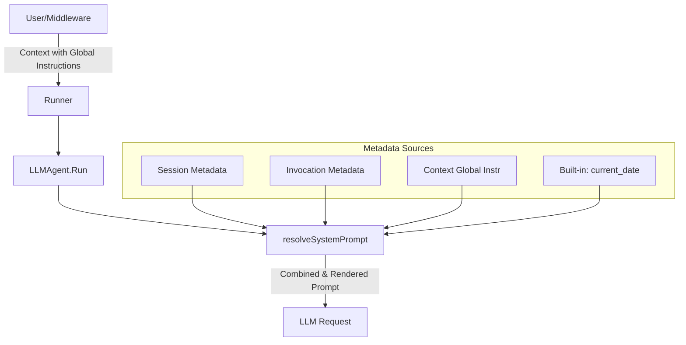

# Design Document: System Prompt Templating & Global Instructions

- **Status:** Draft
- **Author:** Gemini CLI
- **Date:** 2026-05-07
- **Issue:** [redpanda-data/ai-sdk-go#99](https://github.com/redpanda-data/ai-sdk-go/issues/99)

## 1. Abstract

This design proposes a mechanism for dynamic system prompt generation in the AI SDK. It introduces two primary features:
1.  **Variable Injection:** Support for `{variable}` placeholders in system prompts, resolved from session/invocation metadata.
2.  **Global Instructions:** A method to propagate system-wide directives across multi-agent trees using `context.Context`.

## 2. Motivation

Currently, system prompts in `LLMAgent` are static or require a manual callback. Production use cases often require per-invocation data (e.g., "Hello {user_name}") or system-wide constraints (e.g., "Always respond in JSON"). Creating new agent instances for these variations is inefficient and violates the SDK's stateless executor design.

## 3. Proposed Design

### 3.1 Template Resolution
A regex-based templating engine will be added to the `agent` package. It will target placeholders with the syntax `{key}`.

**Technical Safeguards:**
- **Regex:** `\{([a-zA-Z0-9_]+)\}` is used to prevent collisions with JSON objects (e.g., `{"key": "val"}`).
- **Missing Variables:** Unresolved placeholders are left intact to maintain valid JSON/Markdown and aid debugging.
- **Performance:** Regex is pre-compiled at the package level.

### 3.2 Global Instructions
Global instructions are injected via `context.Context`. This allows them to flow naturally through `AgentTool` calls without explicit session mutation.

**Ordering and Templating:**
Global instructions are appended to the base prompt **before** the template resolution phase. This allows global instructions themselves to contain `{variable}` placeholders that will be resolved using the same metadata sources as the base prompt.

**Formatting:**
To prevent the LLM from confusing global instructions with the base prompt, they are appended with a structural separator:
```markdown
---
## Global Instructions
<instructions>
```

### 3.3 Data Flow Diagram



## 4. Implementation Phases

### Phase 1: Core Utilities
- Implement `agent.ResolveTemplate(prompt string, vars map[string]any)`.
- Implement `agent.ContextWithGlobalInstructions` and `agent.GetGlobalInstructions`.

### Phase 2: LLMAgent Integration
- Update `LLMAgent.resolveSystemPrompt` to:
    1. Retrieve base prompt.
    2. Append Global Instructions from context.
    3. Merge metadata from Session and Invocation.
    4. Inject built-in variables (e.g., `{current_date}`).
    5. Run the templating engine.

### Phase 3: Validation
- Unit tests for regex safety (JSON collision tests).
- Integration tests for multi-agent propagation via `AgentTool`.

## 5. Advantages & Considerations

| Feature | Advantage | Consideration |
| :--- | :--- | :--- |
| **Simple Replacer** | Familiar syntax, extremely fast. | Lacks logic (if/else). Handled via `SystemPromptProvider` if needed. |
| **Context Propagation** | Idiomatic Go, zero session pollution. | Requires users to manage the context object correctly. |
| **Fallback Behavior** | Non-breaking; leaves `{var}` intact. | Developers must ensure variables are present if required. |

## 6. Alternatives Considered

- **Standard `text/template`:** Rejected due to `{{var}}` syntax conflict with user preference and higher complexity for simple injection.
- **Session-based Globals:** Rejected because it forces state mutation on what should be a transient execution constraint.
