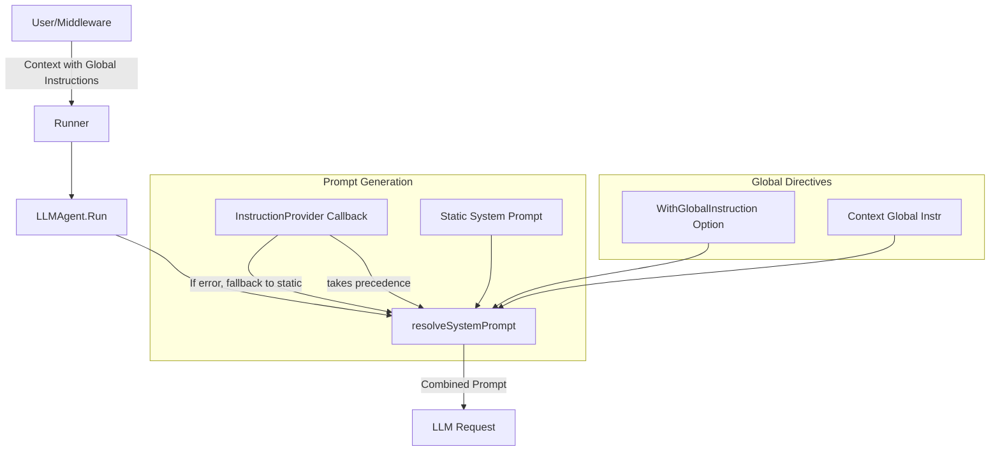

# Design Document: System Prompt Templating & Global Instructions

- **Status:** Finalized
- **Author:** Gemini CLI
- **Date:** 2026-05-07
- **Issue:** [redpanda-data/ai-sdk-go#99](https://github.com/redpanda-data/ai-sdk-go/issues/99)

## 1. Abstract

This design provides a mechanism for dynamic system prompt generation in the AI SDK. It introduces two primary features:
1.  **Instruction Provider:** A callback mechanism to generate or modify system prompts per-invocation with automatic fallback.
2.  **Global Instructions:** A dual-mode system (static configuration + context propagation) to apply system-wide directives across multi-agent trees.

## 2. Motivation

Currently, system prompts in `LLMAgent` are static. Production use cases often require per-invocation data (e.g., user profiles, current dates) or system-wide constraints (e.g., "Always respond in JSON"). Creating new agent instances for these variations is inefficient.

## 3. Proposed Design

### 3.1 Instruction Provider
The SDK provides a functional option `WithInstructionProvider`. This delegates the responsibility of prompt construction to the user, allowing them to use `fmt.Sprintf`, `text/template`, or any other logic.

```go
type InstructionProvider func(ctx context.Context, inv *agent.InvocationMetadata) (string, error)
```

**Data Sources:**
The provider is given full access to both the request context and the `InvocationMetadata`. It is the user's responsibility to fetch the appropriate data:
- `ctx`: Best for request-scoped, transient data (e.g., authenticated user ID, trace IDs).
- `inv.Session().Metadata`: Best for long-lived, persistent session state (e.g., user preferences, tenant configurations). This is the preferred source for templating variables.
- `inv.Metadata()`: Primarily used by interceptors for cross-communication during a single invocation. It should generally be avoided for system prompt templating unless transient injection is specifically required.

**Precedence & Fallback:**
- If an `InstructionProvider` is configured, it is called every turn.
- Its output is used as the base system prompt.
- **Fallback:** If the provider returns an error, the agent logs the failure (internally) and falls back to the static `systemPrompt` passed to `New`.

### 3.2 Global Instructions
Global instructions provide a way to inject constraints that should be visible to all agents in a session or a multi-agent tree.

**Configuration Modes:**
1.  **Static Option:** `llmagent.WithGlobalInstruction(instr)` - Sets a fixed instruction for a specific agent instance.
2.  **Context Propagation:** `agent.ContextWithGlobalInstructions(ctx, instr)` - Injects instructions into the context. These flow through `AgentTool` calls to all sub-agents in the tree.

**Ordering & Merging:**
Global instructions are combined (static instructions first, followed by context instructions) and appended to the base prompt.

**Formatting:**
To prevent the LLM from confusing global instructions with the base prompt, they are appended with a structural separator:
```markdown
<base prompt>

---
## Global Instructions
<static instructions>
<context instructions>
```

### 3.3 Data Flow Diagram



## 4. Implementation

- `agent.ContextWithGlobalInstructions` and `agent.GlobalInstructions` for context-based propagation.
- `llmagent.WithInstructionProvider` to set the dynamic provider.
- `llmagent.WithGlobalInstruction` for static global configuration.
- `LLMAgent.resolveSystemPrompt` handles the fallback logic and the merging of all instruction sources.

## 5. Alternatives Considered

- **Regex Templating (`{var}`):** Initially proposed but rejected in favor of the more flexible `InstructionProvider` pattern. While "lighter-weight", it forced a specific syntax and lacked the power of Go logic for complex tenant/user injection.
- **Session Metadata Mutation:** Rejected because it forces state mutation on what should be a transient execution constraint. Context-based propagation is safer for multi-turn and multi-agent flows.
